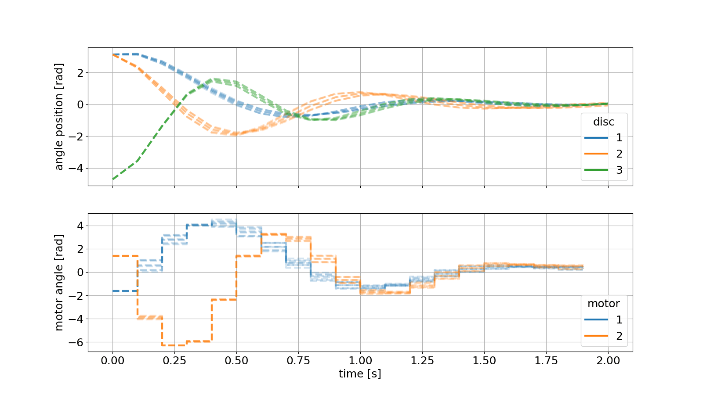

# How to Install do-mpc

This guide explains how to set up your environment to run the `do_MPC/getting_started.ipynb` and `do_MPC/getting_started.py` files.
Here is the link to the example: https://www.do-mpc.com/en/latest/getting_started.html
---

## 1. Install Dependencies

You can install all the necessary packages using the provided `requirements.txt` file.

1. Make sure your virtual environment is activated.
2. Run the following command:

   ```bash
   pip install -r requirements.txt
   ```
3. Now you can just run the file.

## 2. Results of the simulation

**In the Images folder you can find a gif with the results of the MPC example.**



## Example of doMPC with Lorenz actractor
::: do_MPC.hello_mpc

