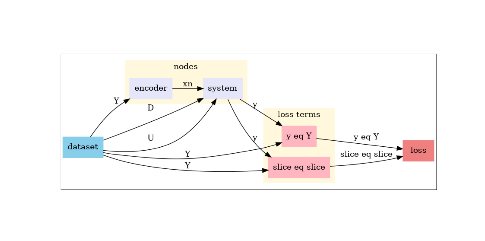

# Neuromancer NODE for Building Dynamics

This example demonstrates how to use Neuromancer to build and train a Neural Ordinary Differential Equation (NODE) model for predicting building dynamics based on sensor and actuator data.

### What is Neuromancer?
Neuromancer is a Python library for physics-informed machine learning, enabling the integration of neural networks with dynamical systems, constraints, and optimization problems.

### Why NODE?
Neural ODEs model continuous-time dynamics using differential equations parameterized by neural networks. They are ideal for:

- Capturing complex temporal dependencies.
- Handling irregular sampling.
- Providing interpretable latent dynamics.

#### What are latent dynamics
A latent space is a lower-dimensional representation of your system’s state that captures the essential dynamics without modeling every physical variable explicitly.
Instead of working in the original high-dimensional space (e.g., all sensor readings), we map the data into a compact latent representation.

>It acts like a compressed version of the system state, preserving the most important features for predicting future behavior.

### Workflow Overview
1. Data Preparation  
   - Load building dataset from CSV.
   - Normalize and create time-windowed sequences.
   - Split into train/dev/test sets.

2. Model Construction  
   - Encoder: Maps observed outputs to latent initial state.
   - NODE: Continuous-time latent dynamics integrated with RK4.
   - Decoder: Maps latent states back to physical outputs.

3. Training  
   - Define objectives (trajectory tracking, one-step prediction).
   - Optimize using Adam.
   - Validate and test on unseen data.

4. Evaluation  
   - Compare predicted vs. true trajectories.
   - Visualize inputs, disturbances, and outputs.

### Desing Choices
1. Latent Space Representation

    *   **Choice:** Use a latent space (`nx`) instead of modeling all physical variables directly.
    *   **Why:**
        *   Reduces dimensionality → faster training and less overfitting.
        *   Captures essential dynamics without noise from irrelevant features.
        *   Enables NODE to learn smooth continuous-time dynamics in a compact space.

2. Neural ODE with RK4 Integration

    *   **Choice:** Integrate the learned ODE using **Runge-Kutta 4 (RK4)**.
    *   **Why:**
        *   RK4 is a **stable and accurate** numerical method for solving ODEs.
        *   Better than Euler for stiff or nonlinear systems.
        *   Ensures smooth trajectories, which is critical for building thermal dynamics.

3. Activation Functions

    *   **Encoder & Decoder:** `ReLU`
    *   **Dynamics:** `Tanh`
    *   **Why:**
        *   **ReLU** in encoder/decoder → avoids vanishing gradients, good for mapping raw data to latent space and back.
        *   **Tanh** in dynamics → bounded output, suitable for continuous-time evolution where extreme values can destabilize integration.

4. Normalization (Z-score)

    *   **Choice:** `(x - mean) / std` for Y, U, D.
    *   **Why:**
        *   Neural networks train better when inputs are normalized.
        *   Prevents dominance of variables with large scales.
        *   Improves convergence and stability during optimization.

5. Loss Functions

    *   **Trajectory Loss:** Full sequence tracking
    *   **One-step Loss:** Immediate next-step accuracy
    *   **Why:**
        *   Trajectory loss ensures long-term prediction accuracy.
        *   One-step loss prevents error accumulation and improves short-term control performance.

6. Latent Dimension & Hidden Sizes

    *   **Choice:** `latent_space_dimensions` and `hsizes=[40]` or `[40,40]`.
    *   **Why:**
        *   Small latent dimension → avoids overfitting and keeps NODE interpretable.
        *   Hidden sizes chosen to balance expressiveness and computational cost.

7. Optimizer & Learning Rate

    *   **Choice:** Adam with `lr=0.003`.
    *   **Why:**
        *   Adam handles sparse gradients and adaptive learning rates well.
        *   0.003 is a good starting point for NODE models (empirically stable).

8. Early Stopping

    *   **Choice:** `patience` and `warmup` in config.
    *   **Why:**
        *   Prevents overfitting.
        *   Stops training when validation loss stops improving.

9. Why Neural ODE for Buildings?

    *   Building thermal dynamics are **continuous-time** and influenced by external disturbances.
    *   NODE captures these dynamics better than discrete models like RNNs.
    *   Provides interpretability and flexibility for control applications.

---

### **Loss Functions**

In this implementation, two complementary loss functions are used to train the Neural ODE model:

***

#### **1. Trajectory Tracking Loss**

```python
# trajectory tracking loss
reference_loss = 5.*(yhat == y)^2
reference_loss.name = "ref_loss"
```

**Meaning:**

*   `yhat`: Predicted outputs over the full horizon.
*   `y`: Ground truth outputs.
*   `(yhat == y)^2`: Neuromancer syntax for squared error across all time steps.

**Mathematical Formulation:**

$$
\mathcal{L}*{\text{trajectory}} = 5 \cdot \sum*{t=0}^{H-1} | \hat{y}\_t - y\_t |^2
$$

**Purpose:**

*   Ensures **long-term accuracy** by penalizing deviations across the entire prediction horizon (H).
*   Weighted by `5.` to emphasize global consistency.

***

#### **2. One-Step Tracking Loss**

```python
# one step tracking loss
onestep_loss = 1.*(yhat[:, 1, :] == y[:, 1, :])^2
onestep_loss.name = "onestep_loss"
```

**Meaning:**

*   Focuses on the **first predicted step** after the initial condition.
*   `(yhat[:, 1, :] == y[:, 1, :])^2`: Squared error for that single step.

**Mathematical Formulation:**

$$
\mathcal{L}\_{\text{onestep}} = 1 \cdot | \hat{y}\_1 - y\_1 |^2
$$

**Purpose:**

*   Improves **short-term precision** and prevents error accumulation.
*   Weighted by `1.` so it complements trajectory loss without dominating.

***

#### **Why Both Losses?**

*   **Trajectory Loss**: Guarantees global consistency over the full horizon.
*   **One-Step Loss**: Improves local precision and stabilizes predictions.

Together:

$$
\mathcal{L}*{\text{total}} = \mathcal{L}*{\text{trajectory}} + \mathcal{L}\_{\text{onestep}}
$$

***

#### **Conceptual Diagram**

Imagine the prediction horizon as a timeline:

    Initial State | Step 1 | Step 2 | ... | Step H
                  ^         ^              ^
                  |         |              |
          One-Step Loss   Trajectory Loss applied across all steps

---
### How Neuromancer Works with NODE

*   NODE represents system dynamics as a continuous-time ODE:
    
    $$
    \frac{dx}{dt} = f(x, u, d)
    $$
    
    where:
    
    *   (x): latent state
    *   (u): control inputs
    *   (d): disturbances

*   Neuromancer integrates this ODE using numerical methods (e.g., RK4) and wraps it in a System object for multi-step rollouts.

*   The workflow:
    1.  Encoder: Maps observed outputs (Y) to latent initial state (x\_0).
    2.  NODE Dynamics: Evolves latent state over time using learned ODE.
    3.  Decoder: Maps latent states back to physical outputs.

---

### Abbreviations and Symbols

| Symbol      | Meaning                                 |
| ----------- | --------------------------------------- |
| nx      | Dimension of latent state space         |
| ny      | Number of observed outputs              |
| nu      | Number of control inputs                |
| nd      | Number of disturbances                  |
| xn      | Initial latent state                    |
| Y       | Observed outputs (temperature, etc.)    |
| U       | Control inputs (valve position, etc.)   |
| D       | Disturbances (weather, occupancy, etc.) |
| H       | Prediction horizon (sequence length)    |
| dt\_sec | Integration timestep in seconds         |

---

## Understanding the Computational Graph



**Figure:** Data flow in the Neural ODE model implemented with Neuromancer.

### What the Graph Shows

*   **Dataset (blue)**: Provides observed outputs (`Y`), control inputs (`U`), and disturbances (`D`).
*   **Encoder (purple)**: Maps observed outputs `Y` to latent initial state `xn`.
*   **System (yellow)**: Represents the NODE dynamics integrated with RK4, predicting future outputs `y` over the horizon.
*   **Loss Terms (pink)**:
    *   `y eq Y`: Compares predicted trajectory `y` to ground truth `Y`.
    *   `slice eq slice`: Compares one-step predictions for short-term accuracy.
*   **Loss (red)**: Aggregates all objectives for optimization.

---

## Implementation

::: thermodynamics_modeling.neuromancer_node.NODE
