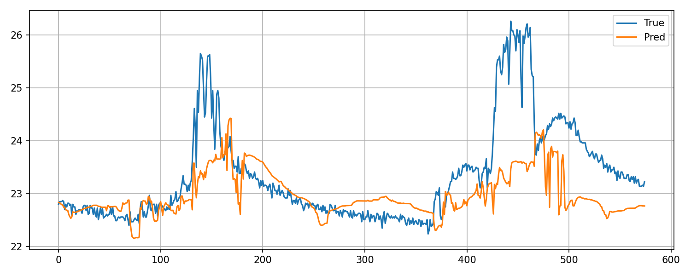

### What are PINNs?

**Physics-Informed Neural Networks (PINNs)** are a class of neural networks that incorporate **physical laws (usually expressed as differential equations)** into the training process. Instead of just fitting data, they **embed the governing equations of the system (like PDEs or ODEs)** into the loss function. This means the model learns not only from data but also respects the physics of the system.

For our building application:

*   Having HVAC dynamics, temperature evolution, airflow, etc., these can often be described by **energy balance equations, heat transfer PDEs, and control dynamics**.
*   A PINN would learn a function that predicts states (temperature, humidity, etc.) while ensuring it satisfies those physical laws.

***

### Why PINNs?

*   **Data efficiency:** They need less data because physics acts as a strong prior.
*   **Generalization:** They extrapolate better to unseen conditions since they respect physical constraints.
*   **Hybrid modeling:** Perfect for cases where you have partial knowledge (some physics + some data).

### How PINNs Work (High-Level)

*   Define a neural network ( $u\_\theta(x,t)$ ) that approximates the solution of our PDE.
*   Compute residuals of the PDE using automatic differentiation.
*   Loss = **data loss** (fit sensor data) + **physics loss** (PDE residuals) + **boundary/initial condition loss**.
*   Train the network to minimize this combined loss.

***

## Core Components of a PINN

A PINN is essentially a neural network trained with a **composite loss function** that enforces both **data fidelity** and **physics consistency**. Here are the main pieces:

### 1. Neural Network Approximation

We define a neural network ( $u\_\theta(x,t)$ ) (or more generally ( $u\_\theta(\mathbf{x}, t)$ )) that approximates the solution of our physical system.

Inputs: spatial coordinates ( $\mathbf{x}$ ), time ( $t$ ), and possibly parameters.

Outputs: predicted state variables (e.g., temperature ( $T$ ), pressure ( $p$ ), etc.).

***

### 2. Governing Equations (ODE or PDE)

These are the **physics constraints** you want the network to respect.

For a building thermal model, you might have:

*   **ODE example (lumped model):**
        $$ \frac{dT}{dt} = \frac{Q\_{\text{in}} - Q\_{\text{loss}}}{C} $$
        where ( $T$ ) is temperature, ( $Q\_{\text{in}}$ ) is heat input, ( $Q\_{\text{loss}}$ ) is heat loss, and ( $C$ ) is thermal capacity.

*   **PDE example (distributed model):**
        $$ \frac{\partial T}{\partial t} = \alpha \nabla^2 T + f(x,t) $$
        where ( $\alpha$ ) is thermal diffusivity and ( $f(x,t)$ ) is a source term.

These equations are **not solved explicitly**; instead, their **residuals** are computed using **automatic differentiation** on the neural network output.

***

### 3. Loss function

The loss combines:

*   **Data Loss:** Fit sensor data (e.g., temperature readings).
    
    $$ \mathcal{L}*{\text{data}} = \sum*{i} | u\_\theta(x\_i,t\_i) - y\_i |^2 $$

*   **Physics Loss:** Enforce PDE/ODE residuals.
    
    $$ \mathcal{L}*{\text{physics}} = \sum*{j} | \mathcal{N}u\_\theta |^2 $$
    
    where ( $\mathcal{N}$ ) is the differential operator from your governing equation.

*   **Boundary/Initial Conditions Loss:** Ensure correct starting and boundary values.

Total loss:

$$
\mathcal{L} = \lambda\_d \mathcal{L}*{\text{data}} + \lambda\_p \mathcal{L}*{\text{physics}} + \lambda\_b \mathcal{L}\_{\text{BC}}
$$

***

### 4. Automatic Differentiation

*   Frameworks like TensorFlow or PyTorch compute derivatives of the NN output w\.r.t. inputs.
*   Example: To compute ( $\frac{\partial u\_\theta}{\partial t}$ ), use `torch.autograd.grad()` or similar.

***

### 5. Training

*   Minimize the composite loss using gradient-based optimization (Adam, LBFGS).
*   Physics residuals guide the network toward physically consistent solutions even with sparse data.

***

## How ODE/PDE Fits In

*   The ODE/PDE is **not solved numerically** like in traditional methods.
*   Instead, it is **encoded into the loss function** as a residual:
    *   Compute derivatives of NN output.
    *   Plug them into the governing equation.
    *   Penalize deviations from zero (or from the correct source term).

This is the **physics-informed part**: the network learns a function that satisfies both data and physics.

***

### A nice way to think about it

Think of the PINN as:

1. A universal function approximator (NN).
2. Constrained by:
    *   Sensor data (empirical truth).
    *   Physical laws (theoretical truth).

***

# ISSUE we need to define the ODE/PDE manually.
We must define the governing equations because:

PINNs need the residual of the physical law in the loss function.

If we don’t know the exact physics, we can:
1. Use simplified energy balance equations.    
2. Or combine PINNs with data-driven discovery (e.g., PySINDy) to learn unknown terms.

# A Simple NN
 

> prediction on the test Dataser for 2 days

::: thermodynamics_modeling.deeepxde_pinn.train_deepxde_supervised

# A PINN example with ODE not currently working properly
::: thermodynamics_modeling.deeepxde_pinn.pinn_deepxde_roomA

