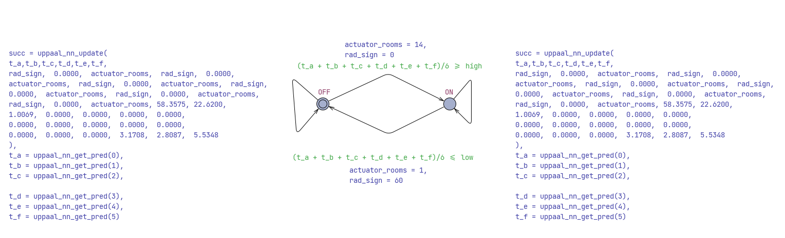

## Architecture graph
```
                  +------------------------------------+
                  |            UPPAAL MODEL            |
                  |                                    |
                  |  Calls native function:            |
                  |     y = query_model(t, x)          |
                  +--------------------+---------------+
                                       |
                                       |  (C function call)
                                       v
            +--------------------------+---------------------------+
            |                     C / C++ LAYER                    |
            |    - Implements query_model(t, x) using libcurl      |
            |    - Builds URL with parameters                      |
            |        http://127.0.0.1:8000/infer                   |
            |    - Sends HTTP GET request                          |
            |    - Parses JSON {"value": y_hat}                    |
            +--------------------------+---------------------------+
                                       |
                                       |  (HTTP POST request)
                                       v
    +----------------------------------+----------------------------------+
    |                            PYTHON SERVER(uvicorn)                   |
    |   - Preloads Neural ODE model (PyTorch)                             |
    |   - Defines /infer endpoint                                         |
    |   - Runs model inference                                            |
    |   - Returns JSON response: {"prediction": y_hat}                    |
    +----------------------------------+----------------------------------+
                                       |
                                       |  (HTTP JSON response)
                                       v
                        +--------------+--------------+
                        |         C / C++ LAYER       |
                        |  Extracts y_hat, returns it |
                        +--------------+--------------+
                                       |
                                       |  (returns value)
                                       v
                              +--------+---------+
                              |     UPPAAL       |
                              |  Continues with  |
                              |     y_hat        |
                              +------------------+
```

## UPPAAL graph
