<!-- _class: lead -->
# Smart Building Control
## Data-driven modelling and control of AAU Build

**CS-IT7-02 Master's Project**  
Computer Science, Aalborg University  
January 24, 2026

---

# Problem Statement

Current BMS issues at TMV 23:
- ❌ Reactive control using independent P controllers
- ❌ No coordination between actuators
- ❌ High energy consumption from conflicting control
- ❌ Frequent overshooting and undershooting
- ❌ Increased mechanical wear and oscillations

**Goal:** Introduce predictive and collaborative control

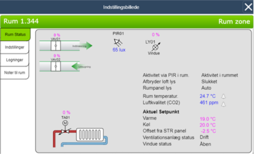

---

# Proposed Solution & Milestones

A data-driven framework combining:

1. **Predictive Model** - Neural ODE trained on 10 months of data
2. **Controller** - UPPAAL-based synthesis with formal verification
3. **Integration** - REST API connecting model and controller
4. **Analysis** - Statistical Model Checking for validation

---

# Dataset Overview

- **Duration:** March 2024 - December 2024 (10 months)
- **Source:** AAU BUILD (TMV 23) BMS
- **Rooms Analyzed:** 6 representative rooms
- **Additional Data:** Weather, occupancy, solar irradiance
- **Process5* Automated quality assurance, missing value handling

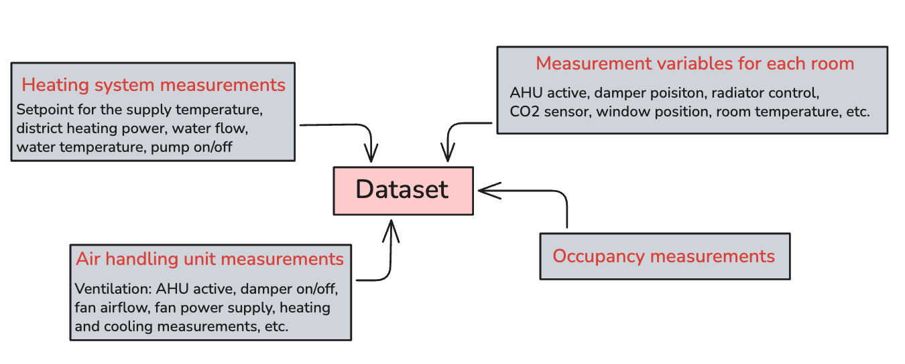

---

# Modelling Approach: NODE

**Neural Ordinary Differential Equations**

Architecture:
- Encoder: projects room state to latent space
- ODE Function: advances latent space in time
- Decoder: reconstructs original space

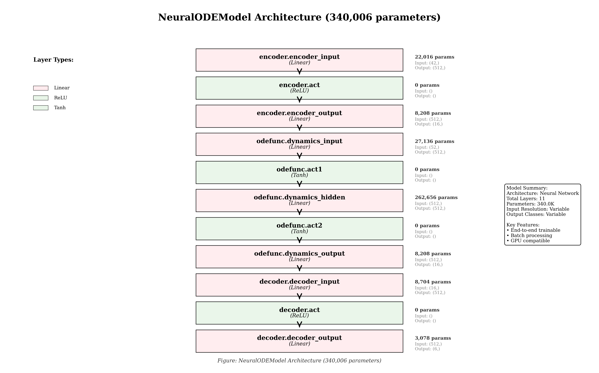

---

# REST API + UPPAAL Integration

**Order of Operations:**

1. NODE model queries via REST API
2. Prediction provided to UPPAAL
3. UPPAAL computes optimal control action
4. Control applied to update state
5. Process repeats every 5 minutes

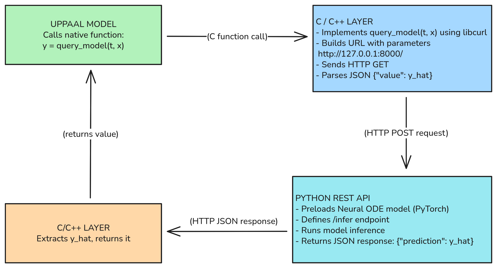

---

# NODE Performance: Closed-Loop

High-fidelity predictions with state updates at each time step

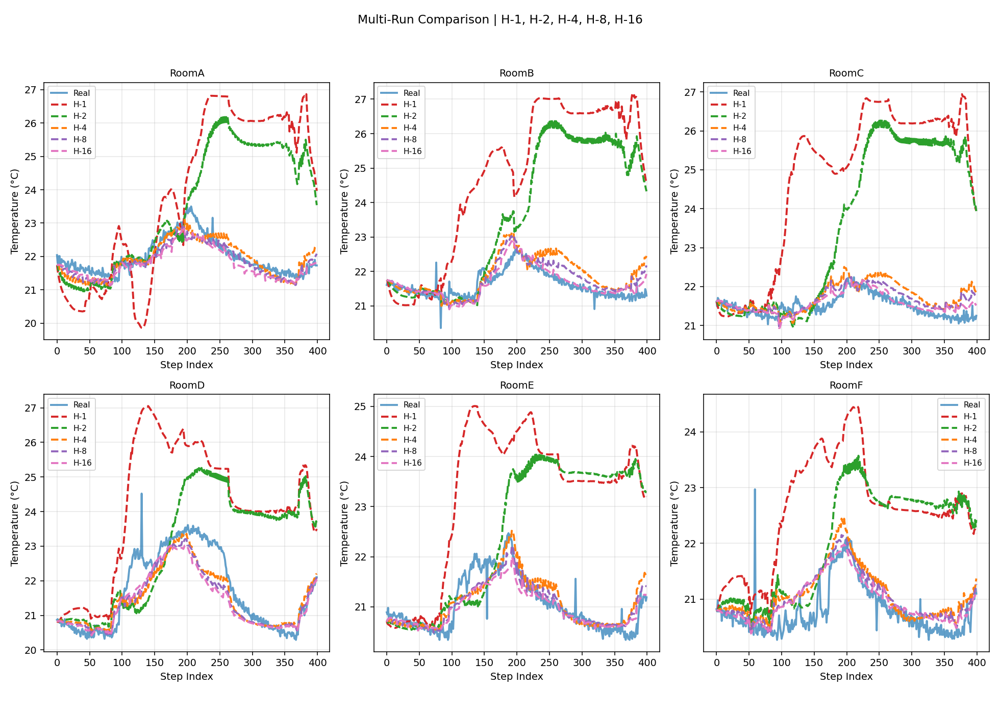

---

# NODE Performance: Open-Loop

Without state updates, error accumulates more rapidly

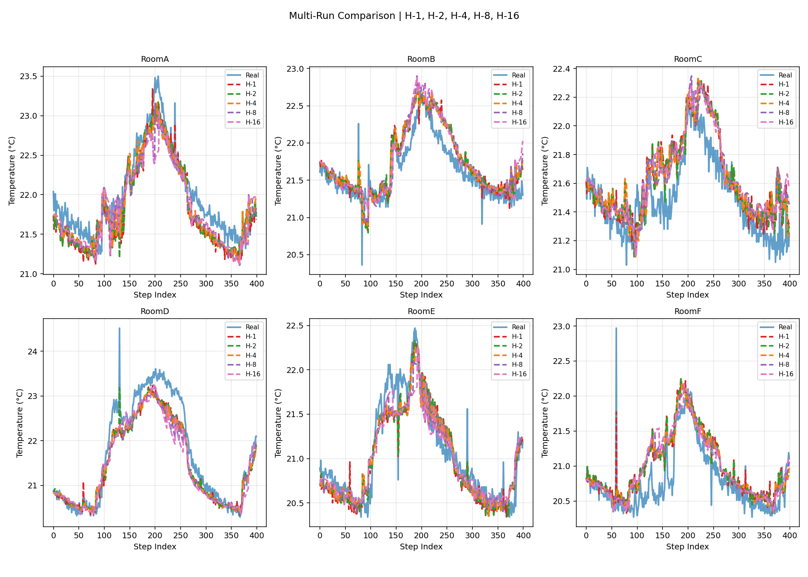

---

# Prediction Horizons: Closed-Loop

**Lower error, maintains accuracy across prediction horizons**

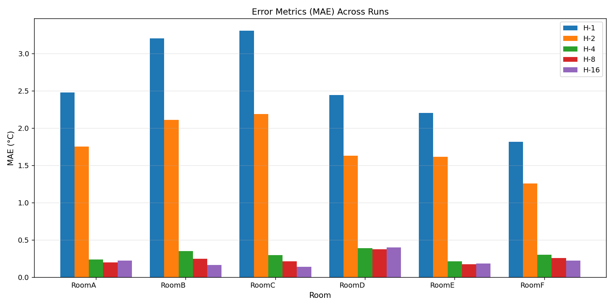

---

# Prediction Horizons: Open-Loop

**Rapid error accumulation as horizon extends**

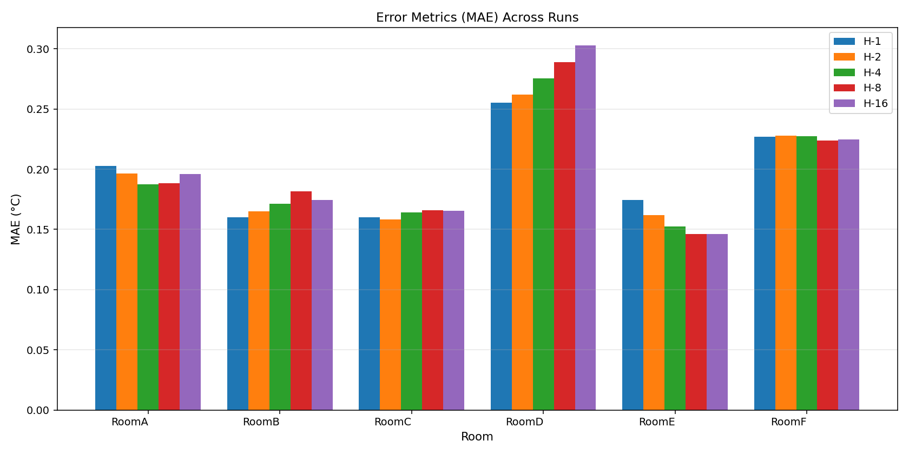

--bg contain

# External Observations Impact

Weather and environmental forecasts improve model accuracy

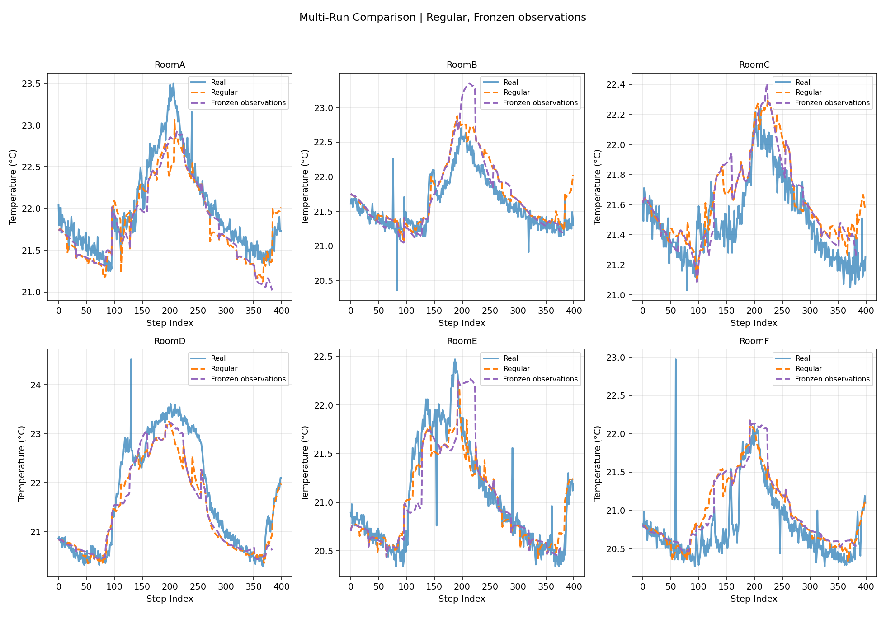

---

# bg contain Strategies

## 1. Random Controller (Baseline)

Unguided control for sanity checking

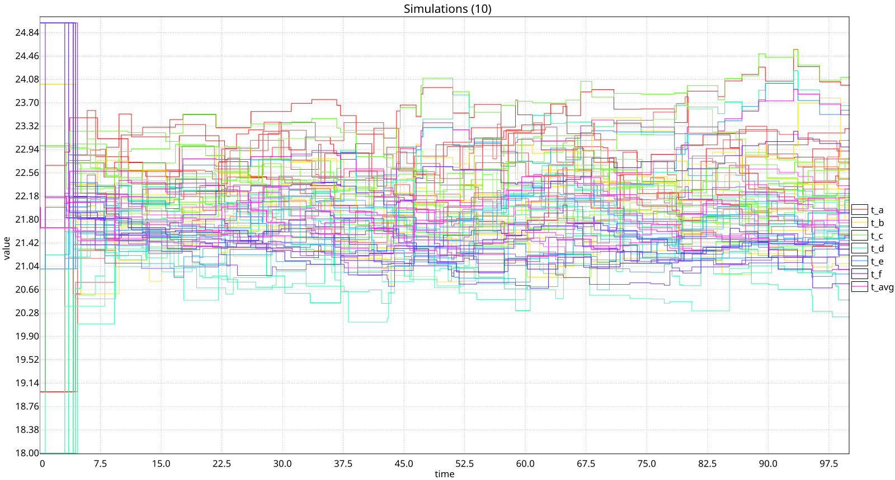

---

# bg contain Strategies

## 2. Bang-Bang Control

Per-room control outperforms global strategy

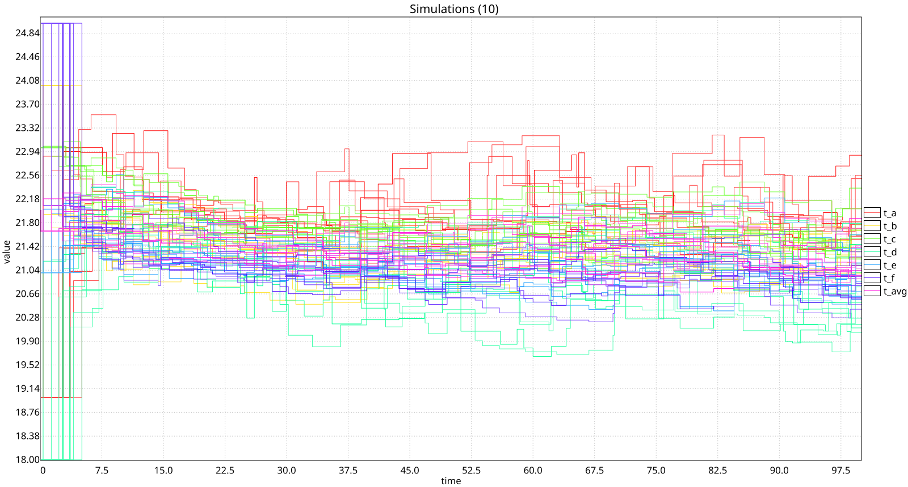

---

# Controller Strategies
bg contain
## 3. Policy Learning Controller

UPPAAL Stratego: Reinforcement learning-based synthesis  
**Result:** Best performance in regulation and efficiency

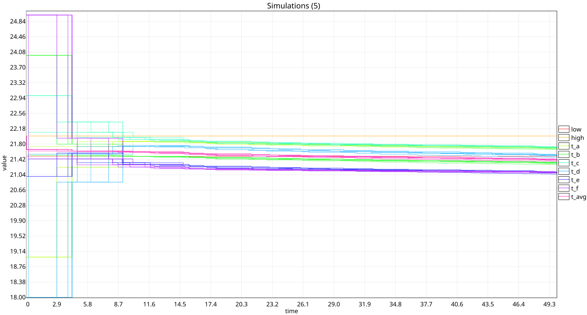

---

# Stability Analysis

System remains within safe temperature bounds

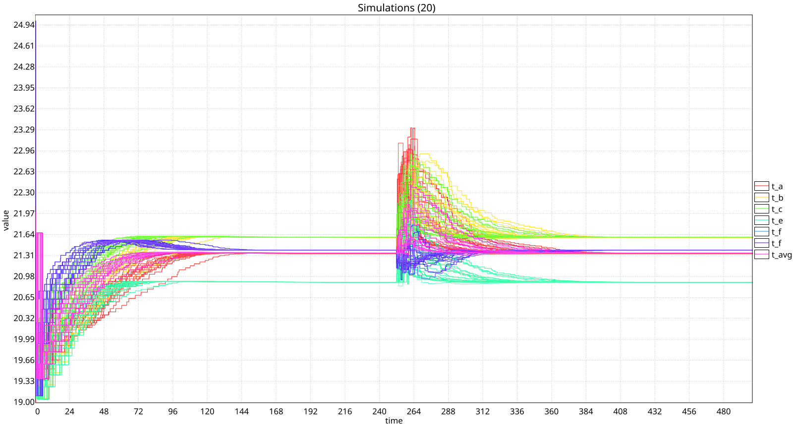

---

# Equilibrium Behaviour

Under different control strategies, system reaches distinct equilibria

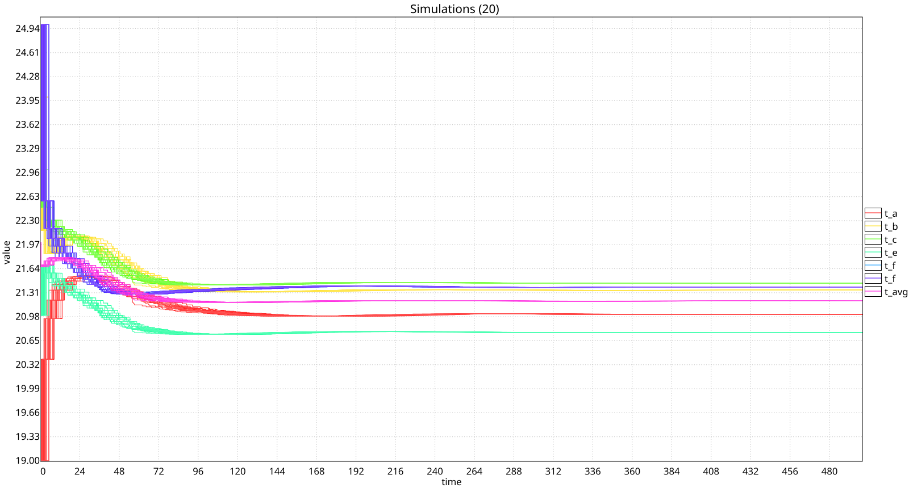

---

# Stability Under Control

System returns to equilibrium after perturbations

---

# Controllability Analysis

Temperature reachability range under different strategies

- **Warm control:** Heating to +5°C above ambient
- **Cold control:** Passive cooling to -3°C below ambient
- **Asymmetric limits** reflect building's thermal constraints

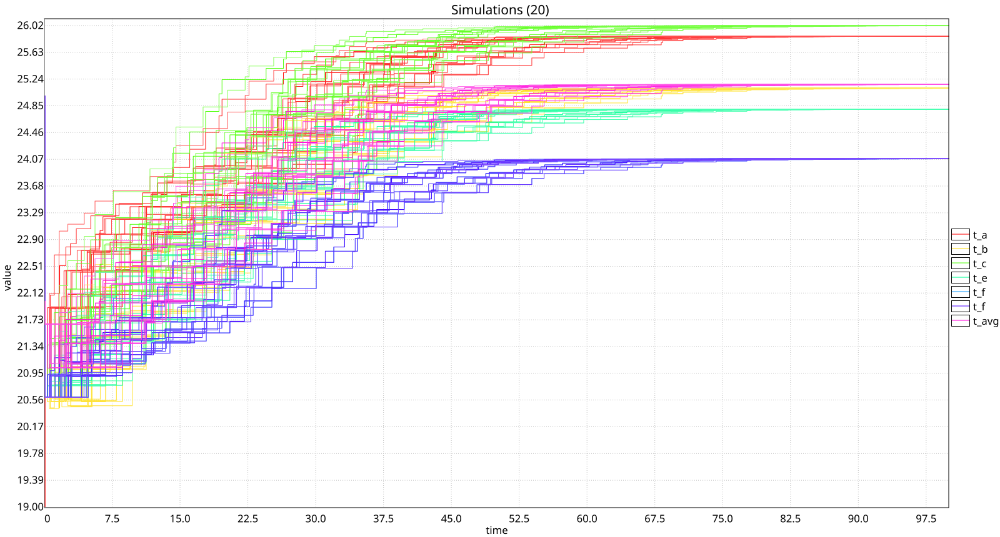

---

# Key Findings

✅ NODE model: Stable, equilibrium-seeking dynamics  
✅ Per-room control outperforms global strategies  
✅ Learning-based controller achieves best performance  
✅ System exhibits expected dynamical properties  
✅ Formal analysis validates safety and controllability  

---

# Technical Achievements

- Integration of learned dynamics with formal synthesis tools
- Statistical Model Checking for black-box model analysis
- REST API bridge enabling PyTorch integration with UPPAAL
- Scalable approach for data-driven building control

---

# Future Work

1. Extend to full building multi-room optimization
2. Integrate with real control hardware
3. Explore cooperative control strategies
4. Incorporate energy cost optimization
5. Develop anomaly detection systems

---

# Conclusion

The NODE + UPPAAL framework successfully demonstrates:
- **Accurate prediction** of building thermal dynamics
- **Effective control** through learned and synthesized strategies
- **Formal validation** of control properties
- **Practical path** to deployment in smart buildings

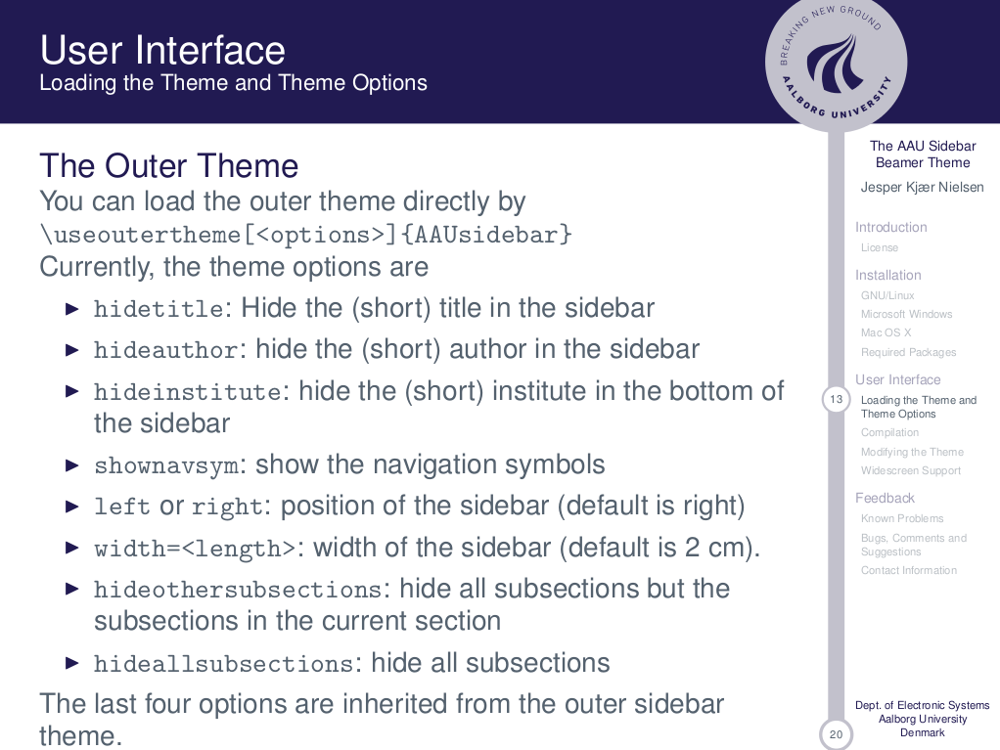

---

# Thank You

**Project GitHub:** https://github.com/AAU-CS-IT-07-02

**Team:**
- Beltrán José Aceves Gil
- Eduard Brahas
- Matei-Mihai Dragomir
- Nasik Ali Khan
- Rares Monda
- Pedro Felizardo Pedroso Carreira Lima

**Supervisor:** Marco Antonio Muñiz Rodriguez

